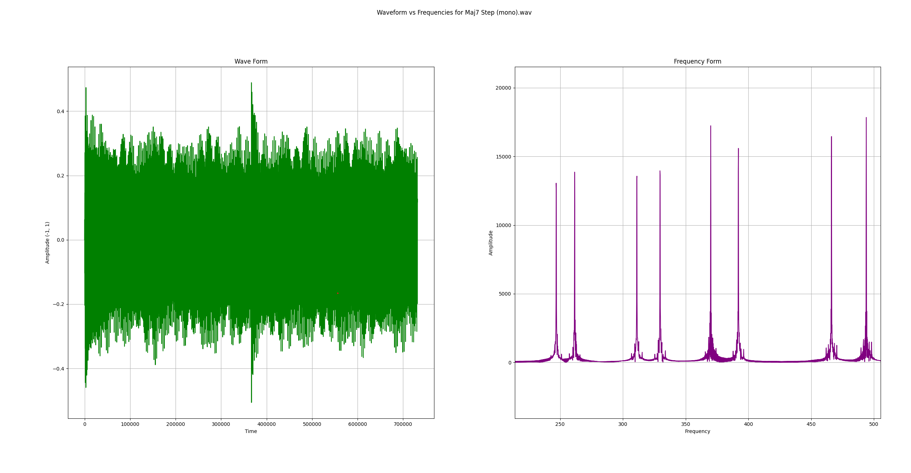
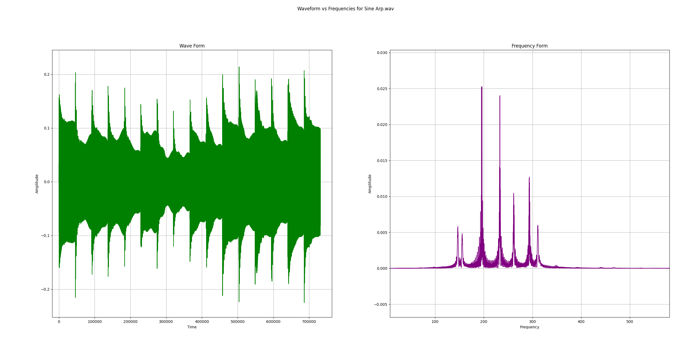
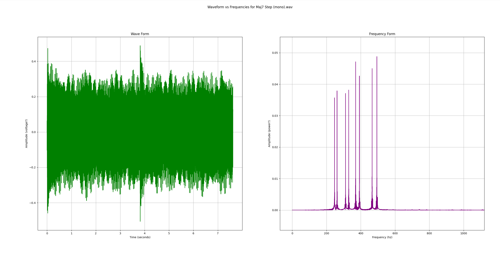

# Analysis of FFT Demo program

##
This short project was my attempt at using the FFT in the scipy library and rendering a visual representation of the initial waveform vs the frequency response. I first chose to plot the frequency response as the raw output of rfft (y-axis) with corresponding frequency values (x-axis). My second approach was to normalize the frequency amplitude with respect to the number of samples. Might come back and update with the ability to analyze stereo inputs.

## Images:
Maj7 Chords - descending by 1 step (mono) - Raw FFT data

Sine arpeggio (treated as mono) - Normalized FFT data

Maj7 Step (Mono) - normalized, labeled with units, and aligned waveform to seconds instead of array index
